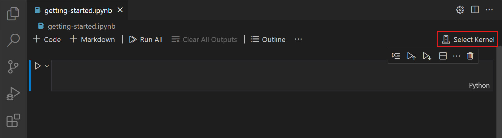
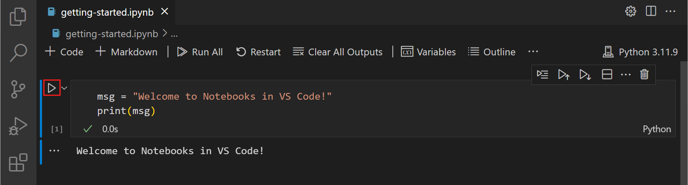

## Setting up a Python Virtual Environment (.venv) with Jupyter Notebooks in VSCode

### Step 1: Install Python and VSCode

1. Install Python https://www.python.org/downloads/
2. Install VSCode https://code.visualstudio.com/Download

### Step 2: Install Required Extensions in VSCode

1. Open VSCode.
2. Install the "Python" extension by Microsoft.
3. Install the "Jupyter" extension by Microsoft.

### Step 3: Create a Virtual Environment (.venv)

1. Open the `libraryCreatorScript.ipynb` file in VSCode.
2. Select a kernel using the kernel picker in the top right.
	
3. Click "Select another Kernel".
4. Click "Python Environments".
5. Click "Create Python Environment".
6. Click "Venv".
7. Click "Create New".

### Step 4: Verify the Virtual Environment

Run the first cell on `libraryCreatorScript.ipynb` and it should download all the needed packages without any errors in less than 30s.
